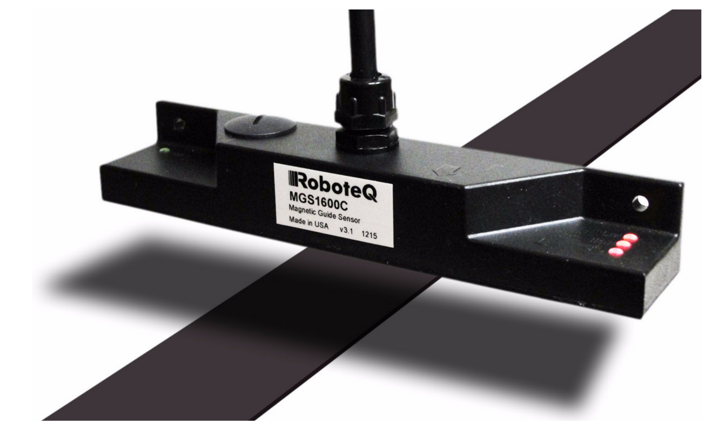

# MGS1600GY-ROS2
RoboteQ line sensor module controller for ROS2.




| ROS2 Distro  | Build status                                                                                                                                                                           |
| ------------ | -------------------------------------------------------------------------------------------------------------------------------------------------------------------------------------- |
| **galactic** | [](https://github.com/HarvestX/MGS1600GY-ROS2/actions/workflows/ci_galactic.yml) |
| **humble**   | [](https://github.com/HarvestX/MGS1600GY-ROS2/actions/workflows/ci_humble.yml)       |

## Requirements
- Linux OS
  - [Ubuntu 20.04](https://releases.ubuntu.com/20.04/)
  - [Ubuntu 22.04](https://releases.ubuntu.com/22.04/)
- ROS 2
  - Galactic
  - Humble

## Setup
Add the user to the dialout group.

```bash
sudo adduser $USER dialout
```

The user will need to log out & log back in again for this to take effect.

## Install
### Locate the package in the workspace
```bash
mkdir -p ~/<Your Workspace>/src
cd ~/<Your Workspace>/src
git clone git@github.com:HarvestX/MGS1600GY-ROS2.git
```

### Install dependencies
```bash
source /opt/ros/$ROS_DISTRO/setup.bash
cd ~/<Your Workspace>/src/MGS1600GY-ROS2
setup.bash
```

### Build source
```bash
cd ~/<Your Workspace>
colcon build
```

## Launch
```bash
source ~/<Your Workspace>/install/setup.bash
ros2 launch mgs1600gy_bringup mgs1600gy.launch.py dev:=<Your Path to Device>
```

## Calibration
```bash
ros2 run mgs1600gy_tool gyro_calibrator --ros-args -p dev:=<Your Path to Device>
```

# References
- [RoboteQ_MGS1600GY](https://www.roboteq.com/products/navigation-sensors/line-following-sensors/mgs1600cgy-magnetic-sensor-with-gyroscope-detail)
